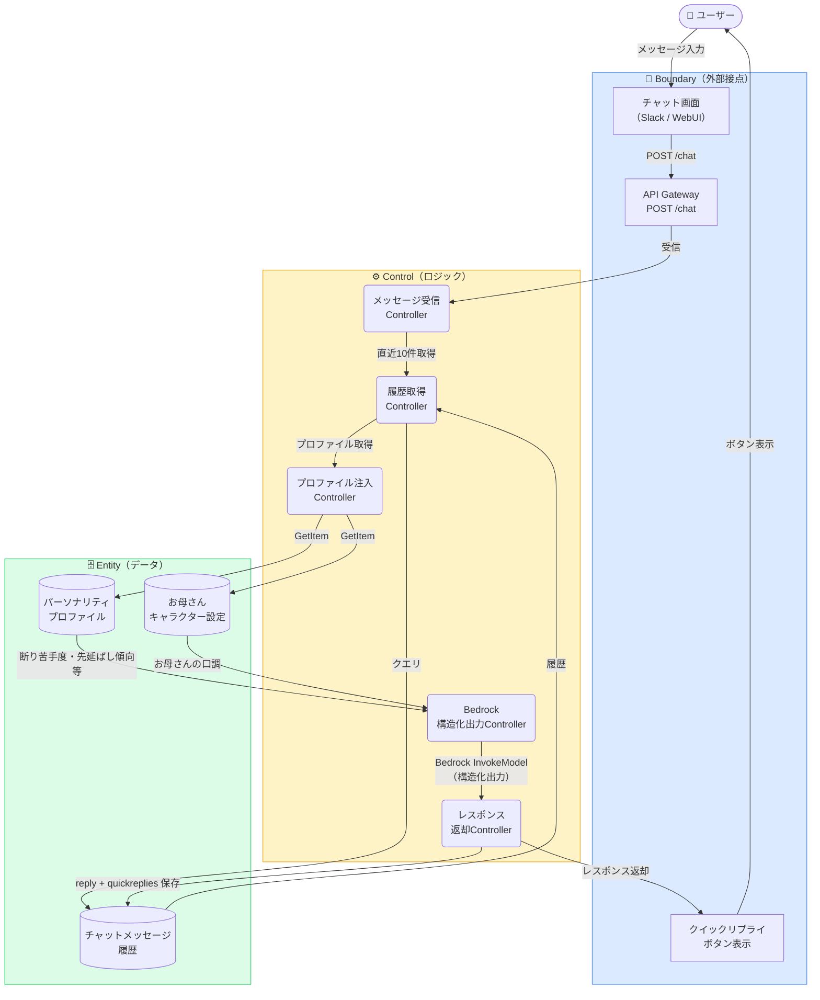
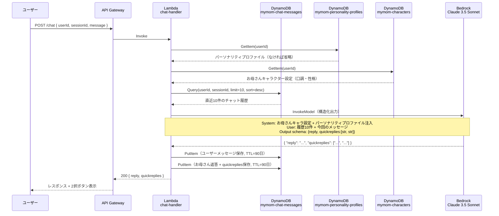

# 機能設計 — chat-ui（チャットUI + クイックリプライ）

## ロバストネス図



---

## シーケンス図



---

## Bedrock構造化出力スキーマ

```json
{
  "type": "object",
  "properties": {
    "reply": {
      "type": "string",
      "description": "お母さんの返答本文"
    },
    "quickreplies": {
      "type": "array",
      "items": { "type": "string" },
      "minItems": 2,
      "maxItems": 2,
      "description": "次の会話候補（必ず2択）"
    }
  },
  "required": ["reply", "quickreplies"]
}
```

---

## クイックリプライ生成ルール

| ルール | 内容 |
|--------|------|
| 常に2択 | 1択・3択以上は禁止 |
| 文脈依存 | Bedrockが会話の流れを読んで動的に生成（固定テンプレート禁止） |
| 行動可能な選択肢 | 選ぶと次の意味ある会話が始まる内容に限定 |
| 選択肢の差別化 | 2択の意味が重複しない |

---

## DynamoDBテーブル: mymom-chat-messages

| 属性 | 型 | 説明 |
|------|----|------|
| `messageId` | String（PK） | UUID |
| `userId` | String | GSI PK |
| `sessionId` | String | GSI SK |
| `senderType` | String | `USER` or `MOM` |
| `content` | String | メッセージ本文 |
| `quickReplyCandidates` | List | 2択文字列（MOMメッセージのみ） |
| `selectedQuickReply` | String | ユーザーがボタンを選択した場合に記録 |
| `quickReplyUsed` | Boolean | 分析用フラグ |
| `sentAt` | String | ISO 8601 |
| `expiresAt` | Number | Unixタイムスタンプ（TTL=90日） |

---

## ビジネスルール

| ルール | 内容 |
|--------|------|
| BR-01 | コンテキストウィンドウは直近10件のみ（トークン効率） |
| BR-02 | パーソナリティプロファイルは存在すれば注入、なければ省略（初期ユーザー対応） |
| BR-03 | チャットメッセージは90日のTTLで自動削除 |
| BR-04 | 自由入力は常に受け付ける（ボタンとの併用） |
| BR-05 | sessionIdでセッション単位の文脈を管理する |
