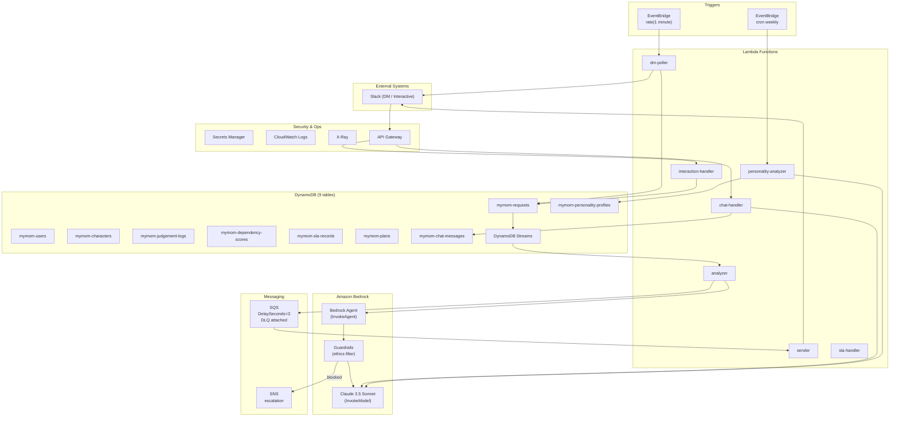

# Shared Infrastructure — MyMom

## Architecture Diagram



## All DynamoDB Tables

| Table | PK | SK | GSI | Streams |
|-------|----|----|-----|---------|
| mymom-requests | requestId | — | userId-index | ✅ (triggers analyzer) |
| mymom-users | userId | — | — | — |
| mymom-characters | userId | — | — | — |
| mymom-judgement-logs | logId | — | requestId-index, userId-index | — |
| mymom-dependency-scores | userId | — | — | — |
| mymom-sla-records | slaId | — | requestId-index | — |
| mymom-plans | userId | — | — | — |
| mymom-chat-messages | messageId | — | userId-sessionId-index | — |
| mymom-personality-profiles | userId | — | — | — |

All tables: on-demand billing mode, region ap-northeast-1.

## Secrets Manager Keys

| Secret Name | Contents |
|-------------|---------|
| mymom/slack-bot-token | Slack Bot OAuth Token |
| mymom/slack-signing-secret | Slack Signing Secret (webhook verification) |

## Resource Tags (applied to all resources)

```yaml
Tags:
  Project: MyMom
  Environment: hackathon
  Team: 音部に抱っこ
```

## Region

All resources: `ap-northeast-1` (Tokyo)
- Bedrock Claude 3.5 Sonnet available in this region
- Optimal latency for Japanese Slack users
