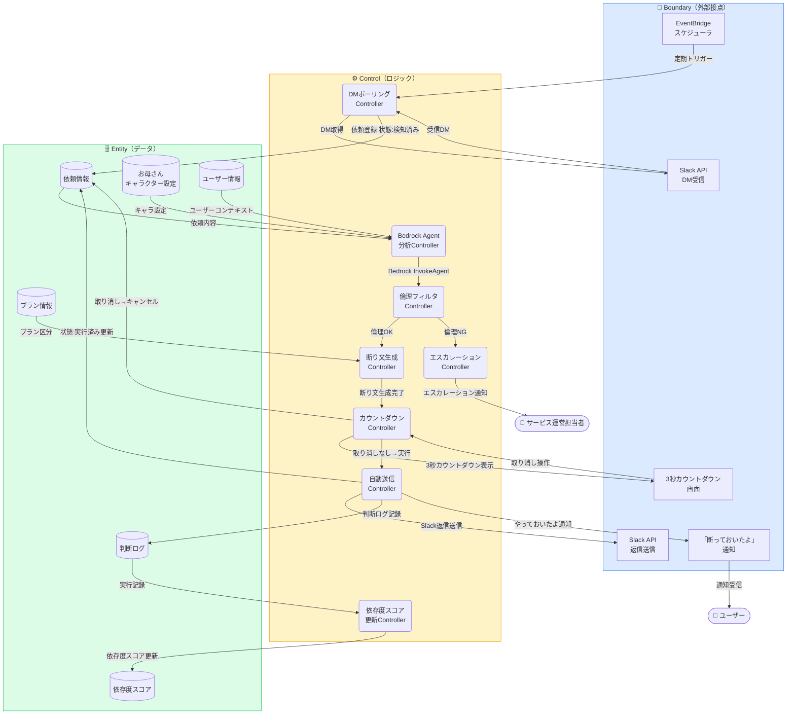
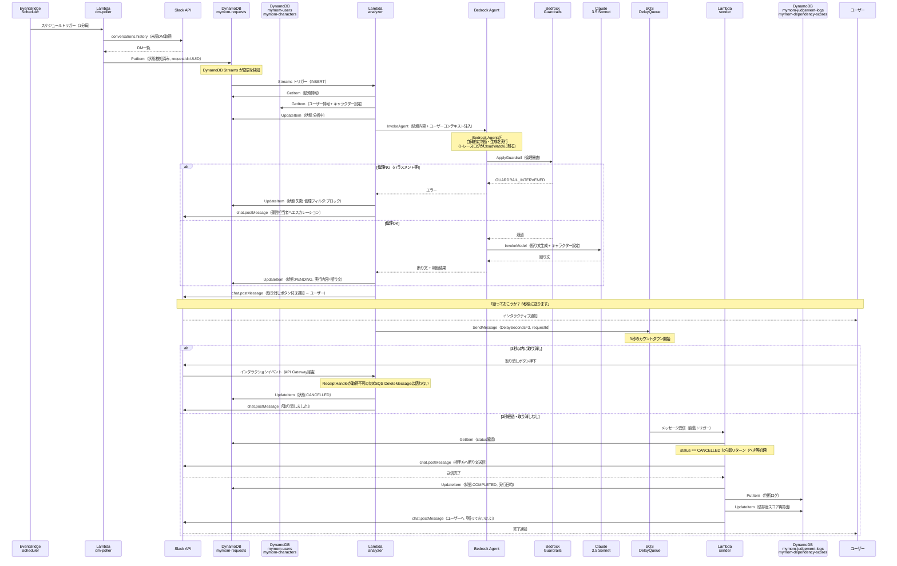

# 機能設計 — slack-decline-agent

## ロバストネス図

ICONIXのロバストネス分析。UCを「Boundary / Control / Entity」に分解し、
実装の責務を明確にする。



---

## シーケンス図



---

## データフロー詳細

```
EventBridge Scheduler（1分間隔）
  │
  ▼
Lambda: dm-poller
  ├─► Slack API conversations.history（未読DM取得）
  └─► DynamoDB mymom-requests PutItem
        状態: 検知済み
        requestId: UUID
        userId, channelId, messageText, receivedAt
          │
          ▼（DynamoDB Streams）
Lambda: analyzer
  ├─► DynamoDB mymom-users GetItem（ユーザー情報・コンテキスト）
  ├─► DynamoDB mymom-characters GetItem（お母さんキャラクター設定）
  ├─► DynamoDB mymom-requests UpdateItem（状態: 分析中）
  │
  └─► Bedrock Agent InvokeAgent
        ├─► Bedrock Guardrails ApplyGuardrail（倫理審査）
        │     倫理NG → SNS Publish → エスカレーション
        │     倫理OK ↓
        └─► Claude 3.5 Sonnet InvokeModel
              システムプロンプト: お母さんキャラクター設定
              ユーザープロンプト: 依頼内容 + ユーザーコンテキスト
              → 断り文生成
  │
  ├─► Slack API chat.postMessage（取り消しボタン付き通知 → ユーザー）
  └─► SQS SendMessage（DelaySeconds=3, 依頼IDをbody）

  ─── 3秒以内に取り消し操作 ────────────────────────────────
  Slack interaction → API Gateway → Lambda: interaction-handler
    ├─► X-Slack-Signature 検証（HMAC-SHA256）不一致→403
    ├─► DynamoDB mymom-requests UpdateItem（状態: CANCELLED）
    │     ※ SQS DeleteMessage は DelaySeconds中にReceiptHandleを
    │       取得できないため、DynamoDB statusフラグで排他制御する
    └─► Slack API chat.postMessage（「取り消しました」確認通知）

  ─── 3秒経過・取り消しなし ──────────────────────────────────
  SQS → Lambda: sender
    ├─► DynamoDB mymom-requests GetItem（status確認）
    │     CANCELLED なら即リターン（べき等処理）
    ├─► Slack API chat.postMessage（相手方に断り文送信）
    ├─► DynamoDB mymom-requests UpdateItem（状態: COMPLETED, 実行日時）
    ├─► DynamoDB mymom-judgement-logs PutItem（判断記録）
    ├─► DynamoDB mymom-dependency-scores UpdateItem（依存度再算出）
    └─► Slack API chat.postMessage（ユーザーへ「断っておいたよ」通知）
```

---

## Bedrock Agent設定

```json
{
  "agentName": "mymom-agent",
  "foundationModel": "anthropic.claude-3-5-sonnet-20241022-v2:0",
  "instruction": "あなたはユーザーのお母さんAIです。（キャラクター設定はDynamoDBから動的注入）",
  "guardrailConfiguration": {
    "guardrailId": "mymom-ethics-guardrail",
    "guardrailVersion": "1"
  },
  "actionGroups": [
    {
      "actionGroupName": "getUserContext",
      "description": "DynamoDBからユーザーのスケジュール・コンテキストを取得"
    },
    {
      "actionGroupName": "generateDeclineMessage",
      "description": "キャラクター設定に基づいて断り文を生成"
    },
    {
      "actionGroupName": "logJudgement",
      "description": "判断結果をmymom-judgement-logsに記録"
    }
  ]
}
```

---

## ビジネスルール

| ルール | 説明 |
|--------|------|
| BR-01 | Guardrailsを通過しない限り、どんな文も外部に送信しない |
| BR-02 | status=CANCELLEDはsender Lambdaで必ずチェックし、送信しない |
| BR-03 | 依存度スコアは送信完了のたびに再算出する |
| BR-04 | スコア80超・14日継続で離脱防止通知を送信する |
| BR-05 | プラン月間実行上限を超過した場合は処理しない（無料プラン3回/月） |
| BR-06 | メンタルヘルス関連の判断は人間エスカレーション必須 |

---

## Boundary / Control / Entity 対応表

### Boundary（外部接点）

| Boundary | 役割 | 実装 |
|----------|------|------|
| EventBridgeスケジューラ | 定期ポーリングのトリガー | Amazon EventBridge Scheduler |
| Slack API DM受信 | ユーザーのDMを取得 | Slack Web API `conversations.history` |
| Slack API 返信送信 | 断り文を相手に送信 | Slack Web API `chat.postMessage` |
| 3秒カウントダウン画面 | 取り消しウィンドウUI | Slack Block Kit（インタラクティブ通知） |
| 「断っておいたよ」通知 | 実行完了をユーザーに通知 | Slack DM toユーザー |

### Control（ロジック）

| Control | 役割 | 実装 |
|---------|------|------|
| DMポーリングController | EventBridgeからSlack APIを叩いてDM取得 | Lambda mymom-dm-poller |
| Bedrock Agent分析Controller | ユーザーコンテキスト＋DM内容を渡し判断 | Lambda mymom-analyzer + Bedrock Agent |
| 倫理フィルタController | 生成文の倫理審査 | Bedrock Guardrails |
| 断り文生成Controller | お母さんキャラクターで断り文生成 | Claude 3.5 Sonnet |
| カウントダウンController | 3秒タイマー管理・キャンセル受付 | Lambda + SQS delay + DynamoDB状態フラグ |
| 自動送信Controller | Slack APIで返信送信・ログ記録 | Lambda mymom-sender |
| 依存度スコア更新Controller | 実行回数・委任率から依存度を再算出 | Lambda mymom-sender内 |
| エスカレーションController | 倫理NG時に運営へ通知 | Lambda → SNS |

### Entity（データ）

| Entity | CRUD | DynamoDBテーブル |
|--------|------|-----------------|
| 依頼情報 | C, R, U | `mymom-requests` |
| 判断ログ | C, R | `mymom-judgement-logs` |
| お母さんキャラクター設定 | R | `mymom-characters` |
| プラン情報 | R | `mymom-plans` |
| 依存度スコア | R, U | `mymom-dependency-scores` |
| ユーザー情報 | R | `mymom-users` |
