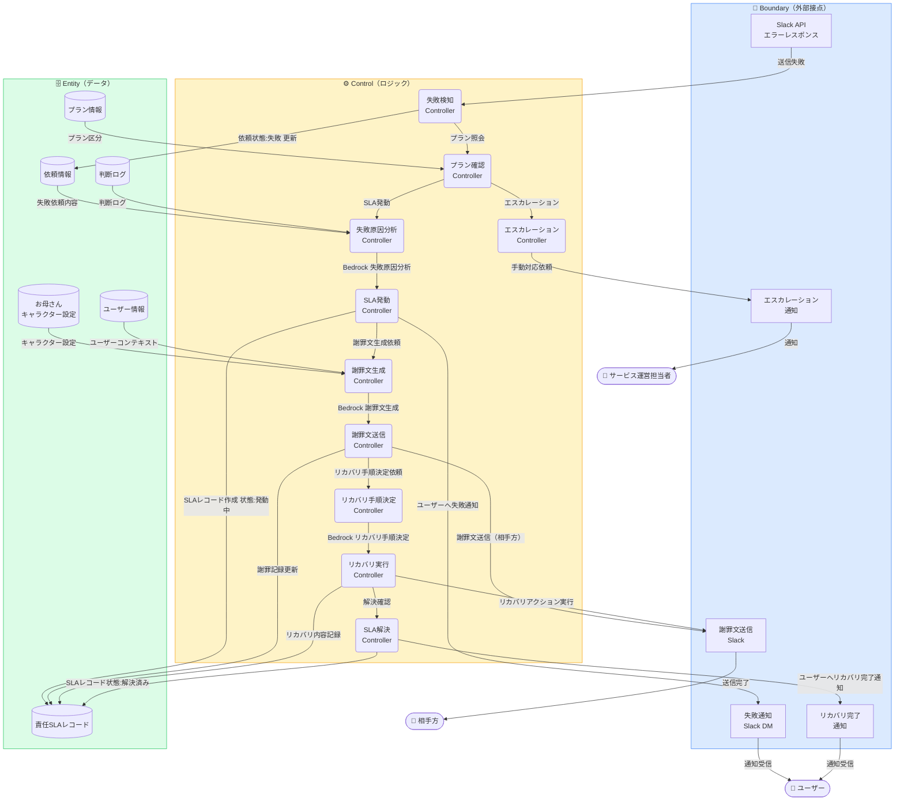
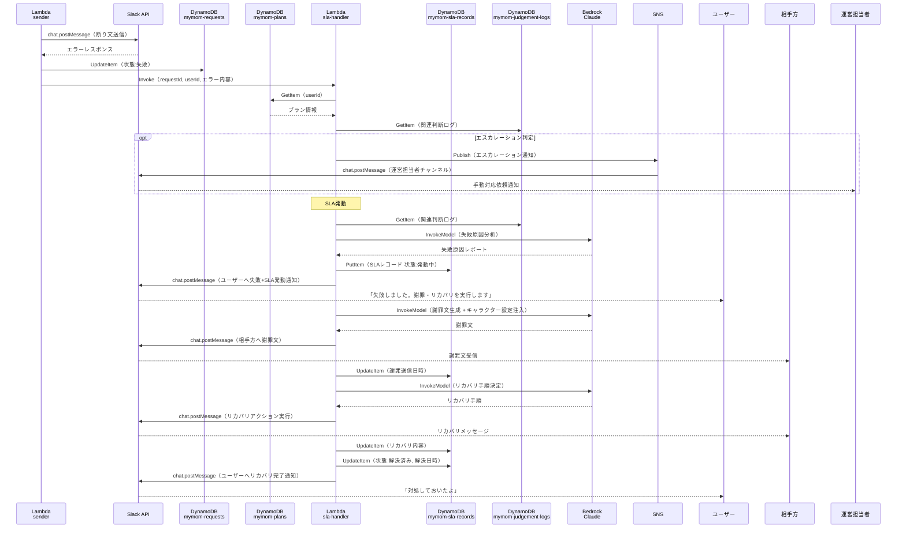

# 機能設計 — 責任SLAフロー

MyMomの自動実行が失敗した場合に発動する謝罪・リカバリフロー。

## ロバストネス図

---

## シーケンス図

---

## Bedrock呼び出し一覧

| 呼び出し目的 | API | 内容 |
|------------|-----|------|
| 失敗原因分析 | `InvokeModel` | エラー内容から原因を特定（権限エラー・送信先不存在・ネットワーク障害等） |
| 謝罪文生成 | `InvokeModel` | お母さんキャラクター設定を注入した謝罪文 |
| リカバリ手順決定 | `InvokeModel` | 再送信・代替チャンネル・手動対応案内から最適手順を選択 |

## DynamoDBテーブル: mymom-sla-records

| 属性 | 型 | 説明 |
|------|----|------|
| `slaId` | String（PK） | UUID |
| `requestId` | String（GSI） | 関連依頼ID |
| `userId` | String | ユーザーID |
| `activationReason` | String | 失敗原因（Bedrock分析結果） |
| `apologySentAt` | String | 謝罪文送信日時（ISO8601） |
| `recoveryContent` | String | リカバリ手順・実行内容 |
| `resolvedAt` | String | 解決日時（ISO8601） |
| `status` | String | `未発動` / `発動中` / `解決済み` |
