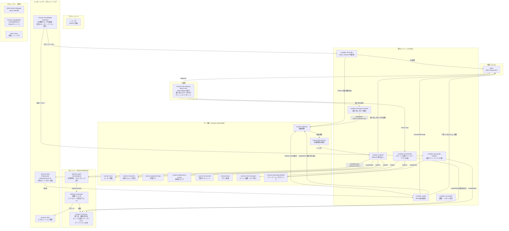

# アプリケーション設計 — MyMom

## 設計原則

> **Push型の本質**: ユーザーのアクションを起点にしない。
> MyMomが先に動き、ユーザーは「対処済み」の報告だけを受け取る。

```
ユーザーが知る前に → MyMomが検知 → MyMomが判断 → MyMomが実行 → ユーザーに「やっておいたよ」通知
```

---

## アーキテクチャ全体図



---

## コンポーネント一覧

### Lambda関数（7本）

| 関数名 | トリガー | 主な責務 | タイムアウト | メモリ |
|--------|---------|---------|------------|--------|
| `mymom-dm-poller` | EventBridge（1分） | Slack DM取得 → DynamoDB登録 | 30秒 | 256MB |
| `mymom-analyzer` | DynamoDB Streams | Bedrock InvokeAgent → 断り文生成 → SQS送信 | 60秒 | 512MB |
| `mymom-sender` | SQS（Delay 3秒・DLQ付き） | status=CANCELLED確認 → Slack送信 → ログ記録 → 依存度更新 | 30秒 | 256MB |
| `mymom-interaction` | API Gateway（Slack callback） | 取り消しボタン処理（3秒以内の応答必須） | 3秒 | 128MB |
| `mymom-sla-handler` | Lambda Invoke（Senderから） | プラン確認 → 謝罪・リカバリ自律実行 | 120秒 | 512MB |
| `mymom-chat-handler` | API Gateway（POST /chat） | チャット応答 + クイックリプライ生成 | 30秒 | 512MB |
| `mymom-personality-analyzer` | EventBridge（週次） | 行動分析 → パーソナリティスコア更新 | 300秒 | 512MB |

### サービス選定理由

| サービス | 役割 | 選定理由 |
|---------|------|---------|
| **Amazon Bedrock Agent** | 依頼内容の自律判断・マルチステップ実行 | InvokeAgentのトレースログがデモで見せられる |
| **Bedrock Guardrails** | 倫理フィルタ | Agentに直接アタッチ可能。Lambda側にロジック不要 |
| **Claude 3.5 Sonnet** | 全テキスト生成 | 日本語品質・構造化出力（JSON schema）対応 |
| **EventBridge Scheduler** | Push型のトリガー起点 | ユーザーのアクションなしにcronで自動起動 |
| **SQS DelayQueue** | 3秒カウントダウン | `DelaySeconds=3`だけで取り消しウィンドウを実現 |
| **DynamoDB Streams** | 依頼登録の即時検知 | 書き込み→処理のリアクティブ連鎖を構築 |

---

## 作業ユニット分解

| ユニット | 説明 | MVP対象 | 優先度 |
|---------|------|---------|--------|
| `slack-decline-agent` | Slack DM検知→自律判断→断り代行→通知 | ✅ | 1（デモコア） |
| `chat-ui` | チャットUI + Bedrockクイックリプライ生成 | — | 2 |
| `personality-analyzer` | 週次行動分析 → パーソナリティカード | — | 3 |

---

## 重要な設計決定

### SQSキャンセルパターン（バグ修正済み）

SQSの`DeleteMessage`は`ReceiptHandle`が必要だが、`DelaySeconds`中は`ReceiptHandle`が取得不可。

**解決策**: DynamoDB状態フラグ（PENDING→CANCELLED）で排他制御。
Sender Lambdaは受信時に状態を確認し、CANCELLEDなら即リターン（べき等処理）。

```
SQS受信後 → DynamoDB GetItem(status)
  status == CANCELLED → return（何もしない）
  status == PENDING   → Slack送信 → UpdateItem(status=COMPLETED)
```

### Guardrailsバージョン固定

`"guardrailVersion": "DRAFT"` はNG（変更が即時反映されるため本番不適）。
デプロイ時にバージョンを発行し番号で固定: `"guardrailVersion": "1"`

### Push型の初期値ON

同意画面で明示確認後、自動実行はONでスタート。
初期値OFFにすると「ユーザーが自分でONにする」プルモデルに逆戻り → Push型体験が永遠に始まらない。
