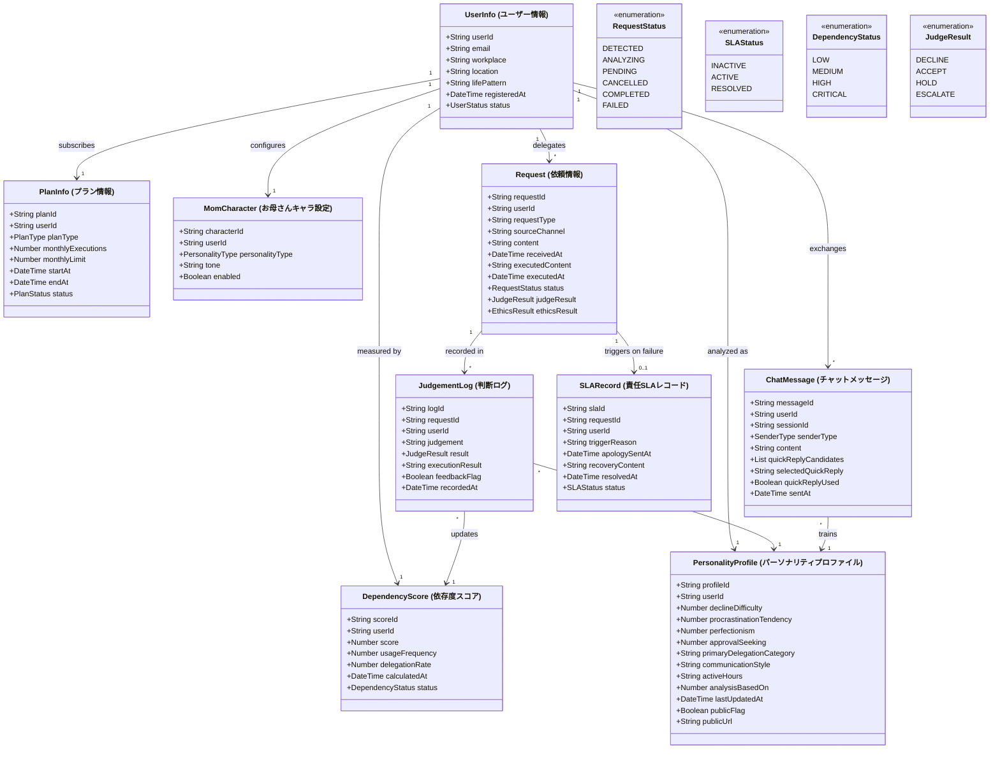

# Domain Entities — MyMom

## Class Diagram

## Entity-to-DynamoDB Table Mapping

| Entity | DynamoDB Table | PK | Notes |
|--------|---------------|-----|-------|
| UserInfo | `mymom-users` | `userId` | |
| PlanInfo | `mymom-plans` | `userId` | |
| MomCharacter | `mymom-characters` | `userId` | |
| Request | `mymom-requests` | `requestId` | GSI: `userId-index` |
| JudgementLog | `mymom-judgement-logs` | `logId` | GSI: `requestId-index` |
| DependencyScore | `mymom-dependency-scores` | `userId` | |
| PersonalityProfile | `mymom-personality-profiles` | `userId` | |
| ChatMessage | `mymom-chat-messages` | `messageId` | TTL: 90 days |
| SLARecord | `mymom-sla-records` | `slaId` | GSI: `requestId-index` |
