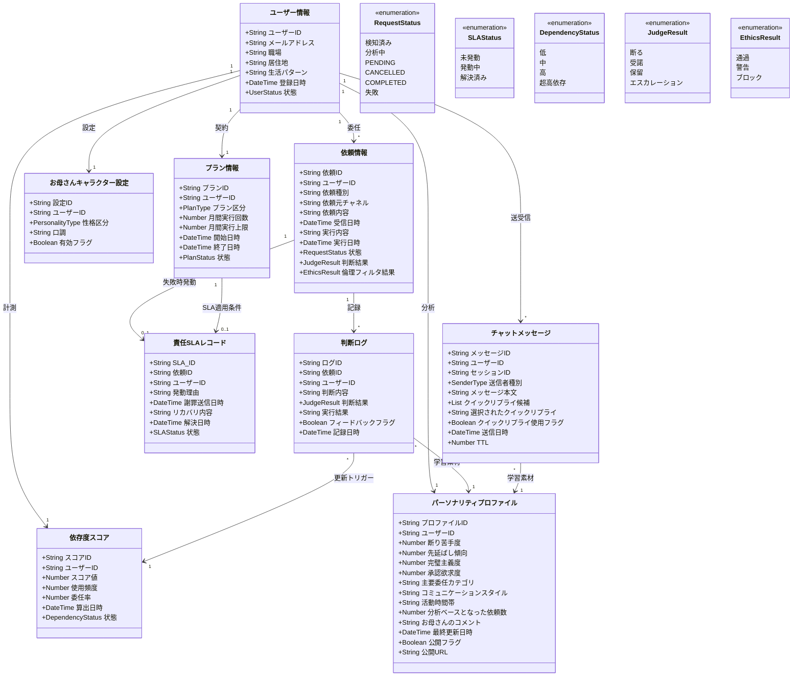

# ドメインエンティティ — MyMom

## クラス図

---

## エンティティの役割

| エンティティ | 役割 |
|------------|------|
| **ユーザー情報** | 中心エンティティ。プロフィール・状態・全関連情報のハブ |
| **依頼情報** | Slack/メール/カレンダーから来る1件の代行依頼。状態遷移の主役 |
| **判断ログ** | Bedrockが下した判断の全記録。誤判断フィードバック・依存度計算に使う |
| **依存度スコア** | 使用頻度×委任率から算出。80超で離脱防止モード発動 |
| **責任SLAレコード** | 有料プランのみ。MyMomが失敗したときの謝罪・リカバリの記録 |
| **お母さんキャラクター設定** | Bedrockへ渡すトーン指示。プランと連動して変化 |
| **パーソナリティプロファイル** | 質問パターン・委任傾向・時間帯を蓄積分析した性格モデル。Bedrockのsystem promptに注入して回答精度を向上。公開カードとして共有可能 |
| **チャットメッセージ** | ユーザーとMyMomの会話履歴。Bedrockが生成した2択クイックリプライ候補を含む |

---

## エンティティ → DynamoDBテーブルマッピング

| エンティティ | DynamoDBテーブル | PK | GSI | 備考 |
|------------|---------------|----|----|------|
| ユーザー情報 | `mymom-users` | `userId` | — | |
| プラン情報 | `mymom-plans` | `userId` | — | |
| お母さんキャラクター設定 | `mymom-characters` | `userId` | — | |
| 依頼情報 | `mymom-requests` | `requestId` | `userId-index` | Streams有効 |
| 判断ログ | `mymom-judgement-logs` | `logId` | `requestId-index`, `userId-index` | |
| 依存度スコア | `mymom-dependency-scores` | `userId` | — | |
| パーソナリティプロファイル | `mymom-personality-profiles` | `userId` | — | |
| チャットメッセージ | `mymom-chat-messages` | `messageId` | `userId-sessionId-index` | TTL=90日 |
| 責任SLAレコード | `mymom-sla-records` | `slaId` | `requestId-index` | |
